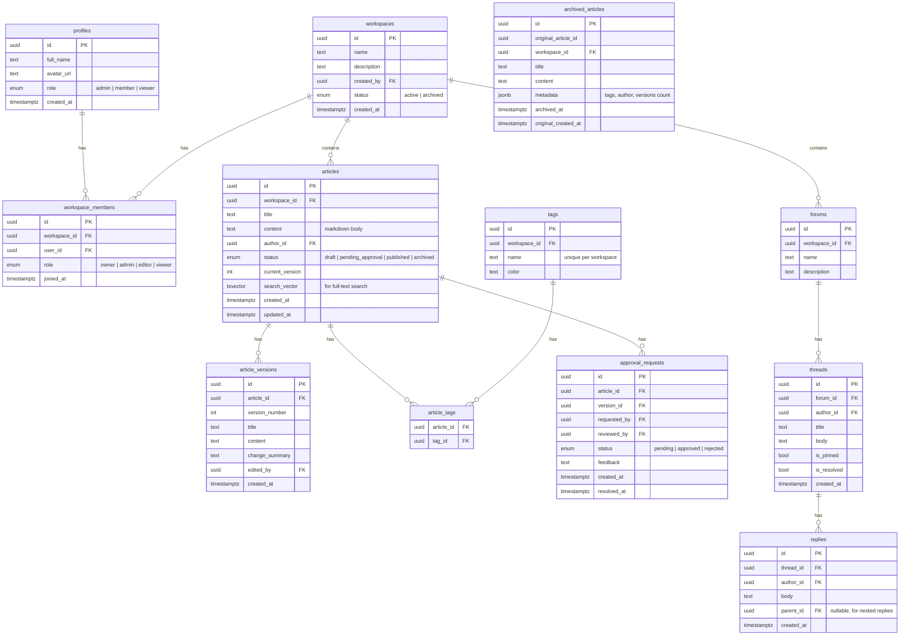

# Smart Team Collaboration & Knowledge Continuity Platform — Implementation Plan

## 1. Overview

**Problem:** Knowledge is scattered across chats, emails, and documents, leading to productivity loss.  
**Objective:** Centralize technical knowledge and decision history in one searchable platform.

| Layer | Tech |
|---|---|
| Frontend | React (Vite), React Router |
| Backend API | Node.js + Express |
| Database & Auth | Supabase (PostgreSQL + Auth + Storage + RLS) |
| Search | PostgreSQL Full-Text Search (via Supabase) |
| Real-time | Supabase Realtime (live discussions, notifications) |

---

## 2. Core Data Model (Supabase / PostgreSQL)



### Row-Level Security Strategy

| Table | Policy |
|---|---|
| `profiles` | Users read/update own profile; workspace members can read co-members |
| `workspaces` | Only members can see their workspaces |
| `workspace_members` | Owners/admins manage; members read |
| `articles` | Workspace members read; editors+ create/update; published visible to all members |
| `article_versions` | Same as articles (read) |
| `tags` | Workspace members read; editors+ create |
| `approval_requests` | Admins/owners can review; author can create |
| `forums`, `threads`, `replies` | Workspace members read/create; author can edit own |
| `archived_articles` | Admins can archive; all members can read |

### Full-Text Search Setup
```sql
-- Trigger to auto-update search_vector on articles
CREATE OR REPLACE FUNCTION update_article_search_vector()
RETURNS trigger AS $$
BEGIN
  NEW.search_vector :=
    setweight(to_tsvector('english', COALESCE(NEW.title, '')), 'A') ||
    setweight(to_tsvector('english', COALESCE(NEW.content, '')), 'B');
  RETURN NEW;
END;
$$ LANGUAGE plpgsql;

-- GIN index for fast search
CREATE INDEX idx_articles_search ON articles USING GIN(search_vector);
```

---

## 3. Folder Structure

```
aifest/
├── client/                        # React (Vite)
│   ├── public/
│   ├── src/
│   │   ├── components/
│   │   │   ├── layout/            # Sidebar, Navbar, Breadcrumbs
│   │   │   ├── articles/          # Editor, viewer, version diff
│   │   │   ├── forums/            # Thread list, reply chain
│   │   │   ├── search/            # Search bar, results, filters
│   │   │   ├── tags/              # Tag badges, picker
│   │   │   ├── approvals/         # Approval cards, status
│   │   │   └── common/            # Buttons, modals, alerts, loaders
│   │   ├── pages/
│   │   │   ├── Dashboard.jsx
│   │   │   ├── WorkspaceDetail.jsx
│   │   │   ├── ArticleEditor.jsx
│   │   │   ├── ArticleView.jsx
│   │   │   ├── ForumView.jsx
│   │   │   ├── SearchResults.jsx
│   │   │   ├── ArchivePage.jsx
│   │   │   ├── Login.jsx
│   │   │   └── Register.jsx
│   │   ├── hooks/                 # useAuth, useSearch, useDebounce
│   │   ├── context/               # AuthContext, WorkspaceContext
│   │   ├── lib/                   # Supabase client init
│   │   ├── utils/                 # Formatters, markdown helpers
│   │   ├── App.jsx
│   │   └── main.jsx
│   ├── index.html
│   ├── vite.config.js
│   └── package.json
│
├── server/                        # Node.js + Express
│   ├── src/
│   │   ├── routes/
│   │   │   ├── auth.js
│   │   │   ├── workspaces.js
│   │   │   ├── articles.js
│   │   │   ├── versions.js
│   │   │   ├── tags.js
│   │   │   ├── search.js
│   │   │   ├── approvals.js
│   │   │   ├── forums.js
│   │   │   └── archive.js
│   │   ├── middleware/
│   │   │   ├── auth.js            # JWT verify via Supabase
│   │   │   └── rbac.js            # Role checks
│   │   ├── services/              # Business logic layer
│   │   ├── utils/
│   │   │   └── supabase.js        # Supabase admin client
│   │   └── index.js
│   ├── package.json
│   └── .env
│
├── supabase/
│   └── migrations/
│       ├── 001_profiles.sql
│       ├── 002_workspaces.sql
│       ├── 003_articles.sql
│       ├── 004_versions.sql
│       ├── 005_tags.sql
│       ├── 006_approvals.sql
│       ├── 007_forums.sql
│       ├── 008_archive.sql
│       ├── 009_search.sql
│       └── 010_rls_policies.sql
│
├── .env.example
└── README.md
```

---

## 4. API Design

### REST Endpoints (Express)

| Method | Endpoint | Auth | Description |
|---|---|---|---|
| **Workspaces** ||||
| GET | `/api/workspaces` | ✅ | List user's workspaces |
| POST | `/api/workspaces` | ✅ | Create workspace |
| GET | `/api/workspaces/:id` | ✅ member | Workspace detail |
| PATCH | `/api/workspaces/:id` | ✅ admin | Update workspace |
| POST | `/api/workspaces/:id/members` | ✅ admin | Add member |
| PATCH | `/api/workspaces/:id/archive` | ✅ admin | Archive workspace |
| **Articles** ||||
| GET | `/api/workspaces/:id/articles` | ✅ member | List articles (filterable by tag, status) |
| POST | `/api/workspaces/:id/articles` | ✅ editor+ | Create article |
| GET | `/api/articles/:id` | ✅ member | Read article |
| PATCH | `/api/articles/:id` | ✅ editor/author | Edit article (creates new version) |
| DELETE | `/api/articles/:id` | ✅ admin | Soft-delete → archive |
| **Version History** ||||
| GET | `/api/articles/:id/versions` | ✅ member | List all versions |
| GET | `/api/versions/:id` | ✅ member | View specific version |
| **Tags** ||||
| GET | `/api/workspaces/:id/tags` | ✅ member | List workspace tags |
| POST | `/api/workspaces/:id/tags` | ✅ editor+ | Create tag |
| POST | `/api/articles/:id/tags` | ✅ editor+ | Assign tags to article |
| **Search** ||||
| GET | `/api/workspaces/:id/search?q=` | ✅ member | Full-text search across articles |
| **Approvals** ||||
| POST | `/api/articles/:id/request-approval` | ✅ editor | Submit for approval |
| POST | `/api/approvals/:id/approve` | ✅ admin | Approve |
| POST | `/api/approvals/:id/reject` | ✅ admin | Reject with feedback |
| **Forums** ||||
| GET | `/api/workspaces/:id/forums` | ✅ member | List forums |
| POST | `/api/workspaces/:id/forums` | ✅ admin | Create forum |
| GET | `/api/forums/:id/threads` | ✅ member | List threads |
| POST | `/api/forums/:id/threads` | ✅ member | Create thread |
| GET | `/api/threads/:id` | ✅ member | Thread + replies |
| POST | `/api/threads/:id/replies` | ✅ member | Post reply |
| **Archive** ||||
| GET | `/api/workspaces/:id/archive` | ✅ member | Browse archived content |
| POST | `/api/articles/:id/archive` | ✅ admin | Archive article |
| POST | `/api/archive/:id/restore` | ✅ admin | Restore from archive |

---

## 5. Key Workflows

### Article Creation & Publishing Flow
```
Author writes article (markdown editor)
  → Saved as draft (status: "draft")
  → Version 1 created in article_versions
  → Author tags the article
  → Author submits for approval → status: "pending_approval"
  → Admin/owner reviews → approves or rejects with feedback
  → If approved → status: "published", visible to all workspace members
  → Each subsequent edit creates a new version entry
```

### Search Flow
```
User types in search bar
  → Debounced request to /api/workspaces/:id/search?q=term
  → PostgreSQL full-text search with ts_rank ordering
  → Results returned with highlighted snippets (ts_headline)
  → Filter by tags, author, date range on frontend
```

### Archival Flow
```
Admin marks article as outdated
  → Article copied to archived_articles with metadata snapshot
  → Original article status → "archived" (hidden from default views)
  → Archived content browsable in separate Archive section
  → Can be restored by admin if needed
```

---

## 6. Security & Non-Functional Requirements

| Requirement | Approach |
|---|---|
| **Auth** | Supabase Auth (email/password + optional OAuth) |
| **Access control** | RLS policies + Express RBAC middleware (defense in depth) |
| **Permission hierarchy** | owner > admin > editor > viewer (per workspace) |
| **Data reliability** | Supabase managed PostgreSQL with automatic backups |
| **Backup & recovery** | Supabase point-in-time recovery + archived_articles table |
| **Quick search** | GIN-indexed `tsvector` full-text search |
| **Conflict resolution** | Version numbering; edits always create new version (no overwrites) |
| **Mobile responsive** | Responsive CSS (media queries / CSS grid) |
| **Data in transit** | HTTPS enforced everywhere |

---

## 7. Phased Development Roadmap

### Phase 1 — Foundation
- [ ] Scaffold Vite + React, Express server
- [ ] Supabase project setup (tables, RLS, search index)
- [ ] Auth: sign up, login, protected routes, profile
- [ ] Basic dashboard: list/create workspaces

### Phase 2 — Knowledge Management Core
- [ ] Article CRUD with markdown editor
- [ ] Version history (save, list, view previous versions)
- [ ] Tag system (create tags, assign to articles, filter by tag)
- [ ] Full-text search with highlighted results

### Phase 3 — Collaboration
- [ ] Discussion forums (create forums, threads, nested replies)
- [ ] Approval workflows (submit, approve, reject)
- [ ] Real-time updates via Supabase Realtime

### Phase 4 — Data Management & Polish
- [ ] Archive outdated content + restore
- [ ] Activity feed / recent changes
- [ ] Mobile responsive design
- [ ] Error handling, loading states, edge cases

---

## 8. Environment Variables Needed

```env
# Client (.env)
VITE_SUPABASE_URL=https://your-project.supabase.co
VITE_SUPABASE_ANON_KEY=your-anon-key

# Server (.env)
SUPABASE_URL=https://your-project.supabase.co
SUPABASE_SERVICE_ROLE_KEY=your-service-role-key
PORT=5000
```

---

## Verification Plan

### Automated Tests
- **Backend:** Jest + Supertest for each Express route → `cd server && npm test`
- **Frontend:** Vitest + React Testing Library → `cd client && npm test`

### Manual Verification (per phase)
1. Register user, login, view dashboard
2. Create workspace, invite members with different roles
3. Write an article, tag it, submit for approval
4. Approve as admin → verify published state
5. Search for articles by keyword → verify relevance ranking
6. Post in forums, reply to threads
7. Archive an article → verify it moves to archive section
8. Verify RLS: viewer cannot edit, non-members cannot see workspace

> [!IMPORTANT]
> Before coding begins, you need to **create a Supabase project** at [supabase.com](https://supabase.com) and share the project URL + anon key + service role key.
